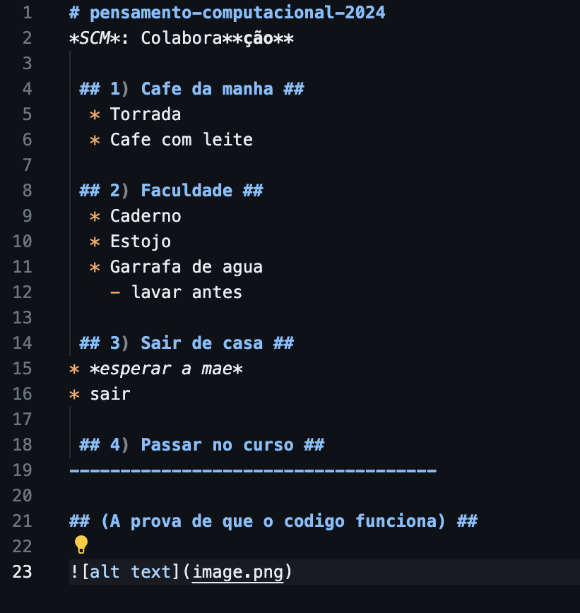

# pensamento-computacional-2024
*SCM*: Colabora**ção**

 ## 1) Cafe da manha ##
  * Torrada
  * Cafe com leite

 ## 2) Faculdade ##
  * Caderno
  * Estojo
  * Garrafa de agua
    - lavar antes

 ## 3) Sair de casa ##
* *esperar a mae*
* sair

 ## 4) Passar no curso ##
------------------------------------

## (A prova de que o codigo funciona) ##

